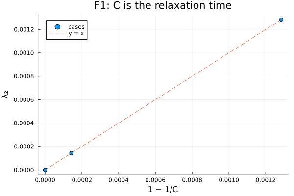
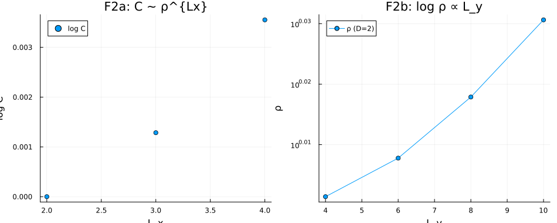
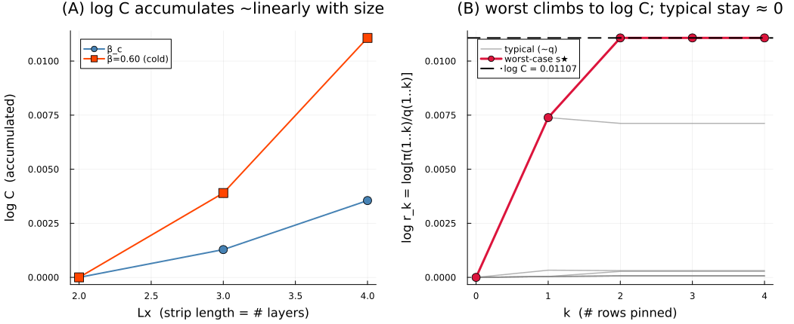
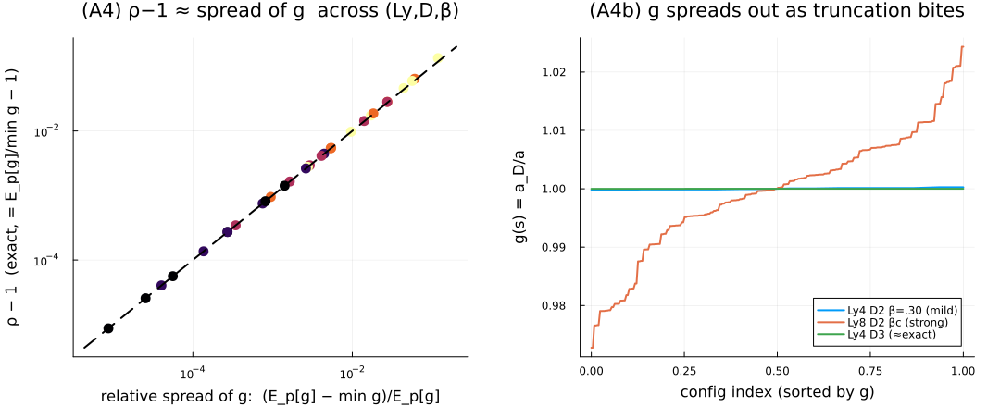

# TNMH mixing times — ICFO internship

*Joaquín Márquez · supervisor: Miguel Frías-Pérez · ICFO*

How fast does a **Tensor-Network Metropolis–Hastings** sampler converge? This repo
answers that for the 2D classical Ising model, both numerically and (now) analytically.

---

## The setup

We sample the Boltzmann distribution `π ∝ e^{−βH}` of the 2D Ising model
(`H = −J Σ σ_iσ_j`, ferromagnetic, open boundaries) on an `Lx × Ly` lattice. The
partition function is written as a `D=2` PEPS; an **approximate** sampler `q` is built
by contracting it row by row with a **boundary MPS** truncated to bond dimension
`D_bound`, sampling spins from the resulting conditionals. That `q` is then the
**proposal** of a Metropolis–Hastings chain that replaces the *entire* configuration
each step — a collective update.

Because the proposal ignores the current state, this is an **Independence
Metropolis–Hastings (IMH)** chain, and its convergence is governed by a single number:

> **`C = max_x π(x)/q(x)`** — the worst-case importance weight (Mengersen–Tweedie).

**The question:** how does `C` — i.e. the mixing time — scale with bond dimension,
system size, and temperature, and *why are empirical acceptance rates so good* even
though the worst case is exponential at criticality?

Based on Frías-Pérez et al., *Collective Monte Carlo updates through tensor network
renormalization*, [SciPost Phys. 14, 123 (2023)](SciPostPhys_14_5_123.md).

---

## The answer (two parts)

**1. Worst case — exact, and exponential.**
The relaxation time is *exactly* `C` (Liu's identity `λ₂ = 1 − 1/C`, verified to
~1e-14). And because the proposal factorizes over rows, `C` decomposes multiplicatively:

> `C ~ ρ(Ly, D, β)^{Lx}`, with `log ρ ∝ Ly` at criticality.

So `C` is **exponential in the system volume** at `β_c` for any fixed `D < 2^{Ly/2}`.
*But the exponent is tiny* — the per-row rate `ρ − 1 ≈ 0.04` at `D=2, Ly=8`, dropping
to `~2e-4` at `D=4` — so the blow-up only matters on large lattices.

**2. Typical case — why it's fast in practice.**
The worst case is set by an **exponentially rare** configuration. The typical
importance weight is `w ≈ 1` (the distribution spans only ±0.006), the χ²-divergence
grows orders of magnitude slower than `C`, and the autocorrelation time is `τ_int ≈
0.5` (independent samples) up to `L = 8`. The acceptance dip near `β_c` only becomes
severe around `L ~ 30–60`. **That is why TNMH works so well in practice.**

**Bond-dimension verdict.** Keeping `ρ` controlled needs only `D = 2–3` at `Ly ≤ 8`;
a strictly size-independent `C` needs `D ~ 2^{Ly/2}`.

**Independent checks.** CFTP coalescence re-derives `C` to 0.9%; TNMH decorrelates
5.8× faster than single-spin Glauber per sweep at `L=8`.

|  |  |
|---|---|
| `C` *is* the relaxation time (`λ₂ = 1 − 1/C`) | `log C` linear in `Lx`; `ρ` exponential in `Ly` |

---

## The analytical result

The numerical story raised the real prize: a **provable** bound on `C` from the
truncation error alone. Working the per-row problem (one truncation), the importance
weight has an exact closed form

> `r(s) = E_p[g] / g(s)`,  where `g(s) =` (truncated weight)/(exact weight) of config `s`,

whose punchline is that **only the *variation* of the truncation across configurations
hurts mixing, not its size** — a uniform error cancels. To first order `ρ − 1 ≈` the
relative spread of `g`, confirmed numerically to **0.3%** across 30 regimes. The full
derivation, the tightened bound, and what remains open (lifting the per-row bound to
the lattice) are in **[THEORY.md](THEORY.md)**.

|  |  |
|---|---|
| `log C` accumulates row by row | `ρ − 1` = the spread of `g` |

---

## How to run

```bash
cd jl/icfo_intern
julia --project=.            # first time: julia> using Pkg; Pkg.instantiate()
```

- **`analysis.ipynb`** — the whole numerical+analytical story in one notebook,
  **recomputed from code**. Every section explains *what* it computes, *why*, and *how the
  code does it*, and exposes the parameters you can change to explore. A full run is
  ≈ 20–30 min (real tensor-network contractions + a brute-force enumeration); sections are
  independent and the slow cells are marked, so you can shrink them for a quick pass.
  Start here.
- **`TNMH_test.ipynb`** — the sampler in action: the phase-transition sweep (acceptance
  rate & energy vs β), reproducing the paper's behaviour.
- **`main.jl`** — the core: Ising PEPS, boundary-MPS proposal, the IMH sweep.
- **`tools/tnmh_tools.jl`** — analysis primitives: exact `C` by enumeration, the IMH
  kernel/spectrum, the per-row diagnostics, CFTP, the accumulation curve.

---

## Folder map

```
README.md                  this file — the human overview
THEORY.md                  the analytical derivation + results
CLAUDE.md                  orientation for AI coding sessions (not meant for humans)
SciPostPhys_14_5_123.md    the reference paper
jl/icfo_intern/
  analysis.ipynb           one notebook: all numerical + analytical results
  TNMH_test.ipynb          the algorithm demo (phase-transition sweep)
  main.jl, tools/          the implementation
  results/                 saved data (.jld2) + headline figures (.png)
  ising_mcmc_results_D2.jld2   the original L=16,32,64 sweep (≈14h of compute)
py/                        earlier Python prototype (superseded by the Julia code)
```

## A couple of notes on the code

- **`ρ` vs `C`.** An earlier version of the project measured the *per-layer* rate `ρ`
  and called it `C`. They are different: `C ~ ρ^{Lx}`. The current code names them
  correctly; if you read older notes, mentally relabel.
- **`py/` is a prototype.** The Julia code in `jl/icfo_intern` is canonical. The Python
  version reproduces the same math but is not maintained.
